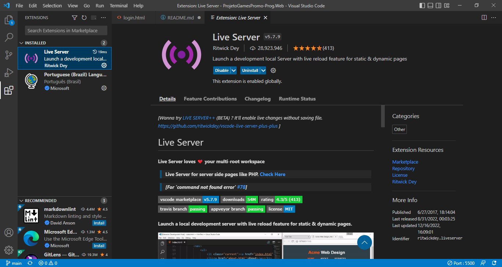
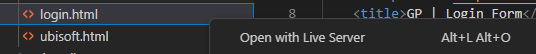

### ProjetoGamesPromo-Prog.Web

## Para funcionar precisa ter instalado a extensão "Liver Server" no VS Code,

## Clicar no "login" com o botão direito no mouse e clicar com o botão esquerdo em "Open with Live Server"
